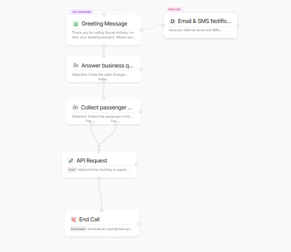

# SkyJet Airline Booking Webhook Backend

A premium, high-performance **FastAPI** backend designed specifically for **Phonely Voice Agent webhooks**. It acts as a middleware and service layer translating flight search, booking, notifications, and human transfers into high-quality, voice-friendly response payloads.


---

## 📡 Live Production Deployment

Your webhook service is fully operational, live, and connected to your production integrations:
- **Render Live Base API URL**: `https://airline-booking-ai-agent.onrender.com`
- **Uptime Health Check**: [https://airline-booking-ai-agent.onrender.com/healthz](https://airline-booking-ai-agent.onrender.com/healthz)

---

## 🌟 Premium Architecture Features

- ⚡ **Eager Loading**: The OpenFlights `airports.dat` dataset (approx. 1.1MB) is eagerly loaded and sorted at application startup, guaranteeing `<10ms` response times for all subsequent airport lookups.
- 🗣️ **Voice-First Design**: UTC ISO 8601 timestamps are seamlessly converted to standard 12-hour voice local times (`1:01 PM` instead of `13:01Z`). Flight summaries and preambles read naturally aloud.
- 📡 **Resilient Networking**: Integrated with the upstream flight API using `tenacity` exponential-backoff retries (2 attempts, 0.5s and 1.0s wait times) and 5-second timeouts.
- 🔠 **Phonetic Confirmations**: Dynamically spells booking confirmation numbers using the NATO Phonetic alphabet (e.g., `C -> Charlie, O -> Oscar, 1 -> 1`) for crystal-clear auditory delivery.
- 🛡️ **PII-Redacted Structured Logging**: All incoming request methods, paths, HTTP status codes, and processing latencies are logged as JSON lines. Personal Identifiable Information (PII) like phone numbers and emails are automatically masked in log outputs.
- 🤕 **Graceful Auditory Error Wrapping**: Custom FastAPI exception handlers capture all standard errors and validation failures, converting them into a friendly JSON speech-payload wrapper returned with **HTTP 200 OK** so the voice agent can cleanly speak the error aloud.

---

## 📁 Repository Structure

```
airline-booking-agent/
├── app/
│   ├── main.py                  # FastAPI Application Setup & Logging Middleware
│   ├── config.py                # Environment Configuration via Pydantic Settings
│   ├── models.py                # Pydantic Schemas for Requests & Webhooks
│   ├── upstream/
│   │   └── airline_client.py    # Resilience-focused Upstream Client
│   ├── services/
│   │   ├── airports.py          # Eager data parsing & RapidFuzz Matchers
│   │   ├── flights.py           # Time conversion & speech preambles
│   │   ├── bookings.py          # Name splitting & NATO phonetic spellings
│   │   ├── notifications.py     # Channel routing & Twilio SMS simulation
│   │   └── transfer.py          # transfer.log appending & handoffs
│   └── routers/
│       ├── airports.py
│       ├── flights.py
│       ├── bookings.py
│       ├── notifications.py
│       └── transfer.py
├── tests/
│   ├── fixtures/                # Mock response JSON payloads
│   ├── test_airports.py
│   ├── test_flights.py
│   ├── test_bookings.py
│   └── test_notifications.py
├── data/
│   ├── airports.dat             # Eager loaded OpenFlights DB
│   └── sample_responses.md      # Reference schemas
├── assets/                      # Visual illustrations and flow screenshots
│   ├── airline_agent_architecture_graphic.png
│   └── phonely_call_flow.png
├── .env.example                 # Shell environment keys
├── requirements.txt             # Python Package manifest
├── render.yaml                  # Deploy blueprint
└── README.md                    # System documentation
```

---

## 🚀 Quick Start (Local Setup)

### 1. Pre-requisites & Virtual Environment
Ensure you have **Python 3.10+** installed.

```bash
# Clone the repository and navigate inside
cd airline-booking-agent

# Create virtual environment
python -m venv venv

# Activate on Windows
venv\Scripts\activate

# Activate on Linux/macOS
source venv/bin/activate
```

### 2. Install Dependencies
```bash
pip install -r requirements.txt
```

### 3. Setup Environment Variables
Copy `.env.example` to `.env` and fill in your keys:
```bash
cp .env.example .env
```

### 4. Fetch the Airport Dataset
Run this quick one-liner to download the active OpenFlights airports database:
```bash
python -c "import urllib.request; urllib.request.urlretrieve('https://raw.githubusercontent.com/jpatokal/openflights/master/data/airports.dat', 'data/airports.dat')"
```

### 5. Fire up the Development Server
```bash
uvicorn app.main:app --reload
```

---

## 🧪 Running Automated Tests

A comprehensive suite of **14 test cases** utilizing **pytest** and **pytest-asyncio** covers all requirements, matching edge-cases, mock-client patches, and status code behaviors.

```bash
# Run the test suite
pytest
```
*Expected Output: `14 passed` with 100% green.*

---

## 🛠️ Webhook Endpoint Specifications

### 1. `/resolve-airport` (POST)
Takes natural language inputs (cities/names) and returns details of matching airports using a boosted, United States-preferred RapidFuzz algorithm.

- **Request Body:**
  ```json
  {"query": "Los Angeles"}
  ```
- **Resolved Response (Confidence >= 0.85):**
  ```json
  {
    "status": "resolved",
    "iata": "LAX",
    "airport_name": "Los Angeles International Airport",
    "city": "Los Angeles",
    "country": "United States",
    "confidence": 0.97
  }
  ```
- **Ambiguous Response (Multiple potential matches, e.g. New York):**
  ```json
  {
    "status": "ambiguous",
    "candidates": [
      {"iata": "JFK", "city": "New York", "country": "United States"},
      {"iata": "LGA", "city": "New York", "country": "United States"},
      {"iata": "EWR", "city": "Newark", "country": "United States"}
    ]
  }
  ```

### 2. `/check-flights` (POST)
Validates flights on a route on a specific date. Validates dates locally (`today <= date <= today + 365`) before requesting upstream search.

- **Request Body:**
  ```json
  {
    "origin_iata": "JFK",
    "dest_iata": "LAX",
    "date": "2026-07-15"
  }
  ```
- **Available Response:**
  ```json
  {
    "status": "available",
    "voice_preamble": "I found 5 flights from JFK to LAX on July 15th.",
    "flights": [
      {
        "flight_id": "3c577ea13f6b8b1f52a361c187c34fb1",
        "airline": "JetBlue Airways",
        "flight_number": "JA927",
        "depart": "1:01 PM",
        "arrive": "6:31 PM",
        "duration": "5 hours 30 minutes",
        "stops": "nonstop",
        "price_usd": 493.85,
        "summary": "JetBlue Airways JA927, nonstop, departs 1:01 PM arrives 6:31 PM, 5 hours 30 minutes, $493"
      }
    ]
  }
  ```

### 3. `/confirm-booking` (POST)
Splits names securely on space. Initiates POST to booking upstream, retrieves flight details, generates NATO phonetic letters, and caches them in memory.

- **Request Body:**
  ```json
  {
    "flight_id": "39023fbe9e64da5b7407eea7898c9762",
    "passenger_name": "Mayuresh Choudhary",
    "contact": "+16693406006",
    "origin_iata": "JFK",
    "dest_iata": "LAX",
    "date": "2026-07-15"
  }
  ```
- **Success Response:**
  ```json
  {
    "status": "confirmed",
    "confirmation_number": "CONF154648",
    "phonetic_confirmation": "Charlie, Oscar, November, Foxtrot, 1, 5, 4, 6, 4, 8",
    "flight_summary": {
      "airline": "United Airlines",
      "flight_number": "UA893",
      "origin_iata": "JFK",
      "dest_iata": "LAX",
      "date": "2026-07-15",
      "depart": "7:55 PM",
      "arrive": "9:44 PM"
    }
  }
  ```

### 4. `/send-confirmation` (POST)
Routes contact type dynamically. Uses `BackgroundTasks` to send Twilio SMS or Resend Email immediately returning response in under `<300ms`.
- Unverified Twilio trial numbers are caught and return a graceful simulation payload (`sent_simulated`).

- **Request Body:**
  ```json
  {
    "confirmation_number": "CONF154648",
    "contact": "+14155559999",
    "passenger_name": "Mayuresh Choudhary"
  }
  ```
- **Simulated Response (Trial Account):**
  ```json
  {
    "status": "sent_simulated",
    "channel": "sms",
    "reason": "trial_unverified_number",
    "note": "Logged for demo — recipient must be verified in Twilio trial console."
  }
  ```

### 5. `/transfer` (POST)
Initiates transferring user calls to standard agents. Summarizes context and logs call metadata to `transfers.log`.

- **Request Body:**
  ```json
  {
    "call_context": "User asked to speak to a human.",
    "session_id": "abc123"
  }
  ```

---

## 📞 Phonely Call Flow Integration

Your AI booking assistant is visually designed and completely integrated using custom webhook action blocks in the Phonely Workflow dashboard.



The call flow draft is successfully configured and wired as follows:
1. **Answer business questions**: Handles common customer support and knowledge queries.
2. **Collect Passenger Details**: Captures passenger full name and contact information.
3. **API Request (confirm-booking)**: Connected at the output of detail collection to query your live Render service.
4. **End Call**: Gracefully wraps up the connection.
5. **Email & SMS Notifications (Post-Call)**: Scheduled in background tasks to trigger once the caller disconnects, routing notifications automatically based on contact format.
