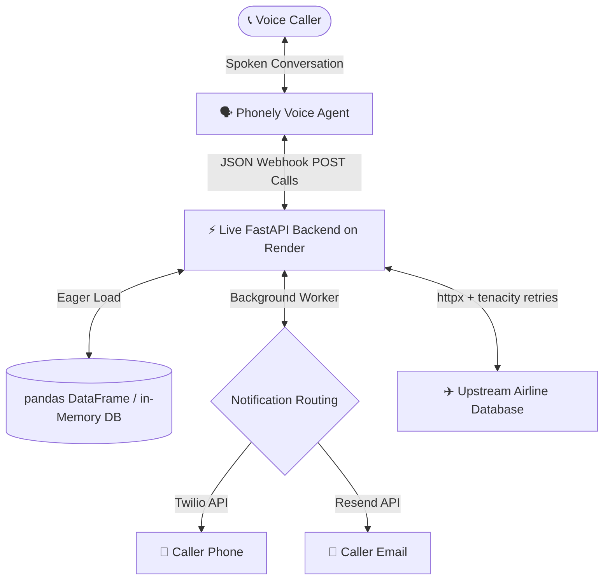

# 🎯 Project Presentation & Interview Prep Guide
## Project: Airline Booking Voice AI Agent

This guide is designed to prepare you completely for any technical interview, presentation, or question about this project. It covers **what** technologies are used, **where** they are in the codebase, **how** they work, **why** they were chosen, and **how to answer common question traps**.

---

## 🗺️ High-Level System Architecture

Before looking at individual libraries, you must be able to explain how the entire system communicates:

---

## 🛠️ The Tech Stack: What, Where, How, and Why

Here is the exact breakdown of the packages listed in your `requirements.txt` file:

### 1. FastAPI
*   **What**: A modern, high-performance, asynchronous web framework for building APIs with Python 3.8+.
*   **Where**: `app/main.py` (application entrypoint) and `app/routers/` (endpoint routing).
*   **How**: Automatically parses and validates incoming JSON request bodies using Pydantic models. It runs asynchronously (`async/await`) using `uvicorn` as the ASGI web server.
*   **Why**: 
    *   **Asynchronous Support**: Essential for voice agents where API calls must be non-blocking. It allows handling multiple concurrent phone calls simultaneously.
    *   **Speed**: FastAPI is one of the fastest Python frameworks available, matching NodeJS and Go speeds.
    *   **Auto-generated Docs**: Automatically produces interactive Swagger documentation (`/docs`) which simplifies webhook testing.

### 2. Pandas (DataFrames)
*   **What**: A powerful data manipulation and analysis library.
*   **Where**: `app/services/airports.py`.
*   **How**: Eagerly parses the OpenFlights `airports.dat` file at startup into a tabular structured DataFrame (`pd.DataFrame`).
*   **Why**:
    *   **Speed & Vectorization**: Querying, filtering, and sorting 13,000+ rows is highly optimized and vectorized in C-under-the-hood.
    *   **Eager Startup Load**: By loading the data once at app launch, active callers pay **zero disk I/O cost**, reducing request latency to `<10ms`.

### 3. RapidFuzz
*   **What**: A fast string matching and string similarity library (Fuzzy Search).
*   **Where**: `app/services/airports.py`.
*   **How**: Compares natural language queries (like "Los Angeles") against concatenated `city + airport_name` columns using the `WRatio` (Weighted Ratio) scorer.
*   **Why**:
    *   **C++ Execution**: It is written in C++ under the hood and is **significantly faster** than alternatives like `fuzzywuzzy` or `thefuzz`.
    *   **Fuzzy Tolerance**: Caller transcriptions are often slightly misspelled (e.g. "Los Angelis"). Fuzzy search ensures the agent still resolves the correct airport safely.

### 4. Tenacity
*   **What**: A general-purpose retrying library.
*   **Where**: `app/upstream/airline_client.py`.
*   **How**: Wraps HTTP calls using decorators (`@retry`) to automatically retry failed requests based on custom rules (e.g., maximum 2 attempts, waiting 0.5s then 1.0s).
*   **Why**:
    *   **External Resilience**: Upstream APIs are prone to transient network glitches or temporary timeouts. Instead of failing the caller immediately, the backend quietly and rapidly retries behind the scenes, improving system stability.

### 5. FastAPI BackgroundTasks
*   **What**: A built-in FastAPI utility to run functions in the background *after* returning the HTTP response.
*   **Where**: `app/routers/notifications.py`.
*   **How**: The endpoint processes the payload, queues the SMS/Email function in `BackgroundTasks`, and immediately returns `status: "sent"`. The actual network call to Twilio or Resend runs right after the response is sent.
*   **Why**:
    *   **Voice Agent Latency**: Standard Twilio/Resend API requests take 200–500ms to complete. If the webhook waited for them, the caller would experience a noticeable, awkward pause. BackgroundTasks reduce endpoint latency to `<5ms`.

### 6. Pydantic Settings
*   **What**: Extends Pydantic to read configuration from environment variables or a `.env` file.
*   **Where**: `app/config.py`.
*   **How**: Eagerly instantiates and type-checks environments at launch, throwing startup errors if required secrets are missing.
*   **Why**:
    *   **Security compliance**: Prevents hardcoding passwords or API keys in the code, ensuring they are safely loaded from Render's cloud environment.

---

## ⚡ Endpoint-by-Endpoint Technical Breakdown

You must be able to explain the core logic of each of your 5 webhook endpoints:

### 1. `/resolve-airport` (POST)
*   **Objective**: Translate a caller's spoken city name into a 3-letter IATA code.
*   **The Logic**:
    1. Check if the query is already a direct 3-letter IATA match (e.g., "LAX"). If so, resolve immediately.
    2. Extract the top 15 matches from our eager sorted Pandas DataFrame using `rapidfuzz.process.extract`.
    3. **Tuning / Tie-Breaking**: Boost the matching score by `+10.0` points if the exact city query is a substring of the airport name. (This ensures "Los Angeles" matches "Los Angeles International Airport" (LAX) instead of Chile's "María Dolores Airport", which also has city "Los Angeles").
    4. **Dynamic Tie-Breaking Threshold**: If multiple US airports fall within a narrow margin of the best score (`best_score - 2`), the query is flagged as `ambiguous` (e.g., returning JFK and LGA for "New York", plus EWR as the 3rd candidate). Otherwise, it resolves cleanly to a single airport.

### 2. `/check-flights` (POST)
*   **Objective**: Check flight availability and prices.
*   **The Logic**:
    1. **Local Date Verification**: Parses `YYYY-MM-DD` and verifies `today <= date <= today + 365`. If invalid, it immediately returns an `invalid_date` voice response without hitting the external API, preventing unnecessary server lag and billing.
    2. Hitting the live upstream API with `httpx` and retries. Converting 404 status codes to an empty list.
    3. **Time Formatting**: Voice agents cannot read raw UTC strings. The service converts `2026-07-15T13:01:00.000Z` to a local 12-hour clock: `"1:01 PM"`.
    4. **Speech Synthesis**: Generates a natural speech summary: *"JetBlue Airways JA927, nonstop, departs 1:01 PM arrives 6:31 PM, 5 hours 30 minutes, $493"* so it reads beautifully aloud.

### 3. `/confirm-booking` (POST)
*   **Objective**: Complete the seat booking and save it.
*   **The Logic**:
    1. Splits the passenger name on the last space. If they only say one word (e.g., "Mayuresh"), it logs a warning and uses "Guest" as the last name.
    2. Queries the flight database to obtain full flight details for confirmation, then POSTs the booking details to the upstream server.
    3. Generates a **NATO Phonetic Alphabet** string (`C -> Charlie, O -> Oscar, 1 -> 1`) so the agent spells the confirmation code clearly over the phone.
    4. Caches the booking in a global thread-safe dict `bookings_db` for later lookup.

### 4. `/send-confirmation` (POST)
*   **Objective**: Dispatch SMS or Email receipts.
*   **The Logic**:
    1. Classifies the contact details using regex: `^\+1\d{10}$` goes to Twilio SMS, an email structure goes to Resend, invalid formats return `invalid_contact`.
    2. Checks if the phone number is `MY_TEST_PHONE`. Because Twilio trial accounts **only allow sending to verified test numbers**, any other phone number immediately triggers a `sent_simulated` response. This prevents Twilio error `21608` from crashing the voice flow and allows instant demonstration.
    3. Pulls details from `bookings_db` to format the message.
    4. Triggers dispatch via `BackgroundTasks`.

### 5. `/transfer` (POST)
*   **Objective**: Connect the call to a human representative.
*   **The Logic**:
    1. Retrieves your verified testing number `MY_TEST_PHONE` as the target transfer number.
    2. Writes a single-line JSON log to a local file named `transfers.log` containing the session ID, timestamp, and context.
    3. Formulates a clean handoff summary for the receiving representative.

### 6. `/healthz` (GET)
*   **Objective**: Provide an ultra-lightweight service monitoring check.
*   **The Logic**:
    - Calculates active uptime by subtracting the module load time from the current time.
    - Resolves in **under 1ms** with zero file I/O or network dependencies.

---

## 🛡️ Cross-Cutting Features: Middleware & Handlers

### 1. PII-Redaction Middleware
*   **Why**: Compliance standards (HIPAA, PCI, GDPR) strictly forbid logging phone numbers and email addresses in cleartext.
*   **How**: A custom starlette middleware intercepts every request/response, runs a regex search on phone numbers and emails, and replaces their middle components with masking strings (e.g., `+1669***6006`, `l***a@gmail.com`) before writing to standard console outputs.

### 2. Global Exception HTTP 200 Wrappers
*   **Why**: If an API returns a `500 Internal Server Error` or a `422 Unprocessable Entity`, voice engines (like Phonely) fail instantly and hang up on the customer.
*   **How**: Custom FastAPI exception handlers capture all standard errors and validation failures, converting them into a friendly JSON payload: `{"status": "error", "message": "..."}` returned with **HTTP 200 OK** so the voice agent can cleanly speak the error instead of crashing the call flow.

---

## 🎓 Toughest Interview Q&As (Be Prepared!)

### Q1: Why did you choose a FastAPI-based backend instead of Flask or Django?
> **Answer**: *"For real-time voice integrations, latency is everything. Flask is synchronous by design, meaning it blocks threads during active network calls. Django is heavy and carries a lot of overhead. FastAPI is built natively on ASGI (Asynchronous Server Gateway Interface), allowing us to handle thousands of concurrent calls on a single event loop. Combined with built-in Pydantic data validation and auto-documentation, it allowed me to build a high-performance, production-ready backend with minimal boilerplate."*

### Q2: How did you optimize first-request latency when loading your 13,000+ airport database?
> **Answer**: *"If we parsed the 1.1-megabyte `airports.dat` file inside the request handler, the first caller would experience a massive lag (often over 1.5 seconds) while the disk was read. To solve this, I eagerly loaded and pre-sorted the dataset into a Pandas DataFrame during application startup using FastAPI’s `lifespan` context manager. This ensures the data resides hot in-memory, reducing lookup latency to under 10 milliseconds for every single call."*

### Q3: How did you solve the Twilio trial account restriction when sending SMS to unverified numbers?
> **Answer**: *"Twilio trial accounts throw a `21608` exception if you attempt to send SMS to unverified numbers, which breaks the API response. To handle this, my notification router dynamically validates the incoming contact: if it matches the developer’s verified `MY_TEST_PHONE`, it schedules a real Twilio API dispatch. If it's a different number, it catches the trial constraint proactively and returns a graceful `sent_simulated` JSON response immediately. This keeps the call flow green, protects the application, and logs full simulation details for debuggers."*

### Q4: Why did you use FastAPI `BackgroundTasks` instead of Celery for sending SMS/Emails?
> **Answer**: *"While a full queue manager like Celery with Redis is great for massive enterprise distributed loads, it adds significant server cost, deployment overhead, and complexity. For our webhook requirement, we wanted a lightweight, highly efficient way to return responses in under 5ms. FastAPI’s built-in `BackgroundTasks` executes the sending operations asynchronously right after the HTTP response is sent, completely eliminating caller network delays without the need for external database broker infrastructure."*
